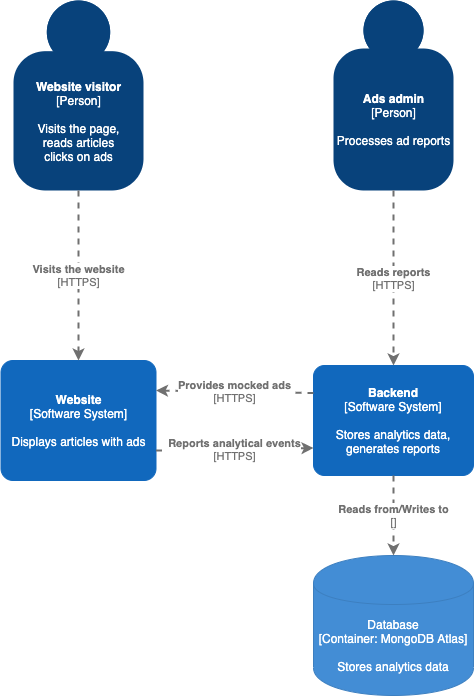

# Ad tracker

## How to

The project requires a connection to MongoDB. 

In prod environment it uses free instance of MongoDB Atlas cluster.

### Run project

1. Provide your MongoDB credentials
2. issue `npm i`
3. issue `npm start`
4. visit http://localhost:3000/mock-ad/ad  

### Run tests

1. Provide your MongoDB credentials
2. issue `npm i`
3. issue `npm test`

### Example usage
* https://ads-tracker-cldnry.herokuapp.com/mock-ad/google - mock ad for Google.com
* https://ads-tracker-cldnry.herokuapp.com/report/2020-11-14 - generate report for 2020-11-14
* https://ads-tracker-cldnry.herokuapp.com/event with payload `{"ad":"google.com", "type": "click"}` and `Content-Type: text/plain` - to report an interaction with Google.com ad.  


## Deployment

Application is deployed through Github Actions Pipeline to Heroku PaaS. 

Please find the app under following link: [https://ads-tracker-cldnry.herokuapp.com/](https://ads-tracker-cldnry.herokuapp.com/)

## API

* `/event` - allows tracking of ad events. 

Accepts POST requests with following body:
```json
{
  "ad": "string",
  "type": "string"
}
```

where `type` is either `load` or `clicked` 

* `/reports/:date` - allows generating daily events report 
Accepts GET requests with `:date` parameter in `yyyy-MM-dd` format

## High Level Architecture



### Considerations:
- c4 model chosen as an appropriate tool for architecture visualization
- ad mocker integrated into the tracking api through a separate mocking router 
- date-fns for handling dates 
- assumed enGB locale
- dateProvider as an injectable plain JS object to make testing and possible future operations on dates isolated
